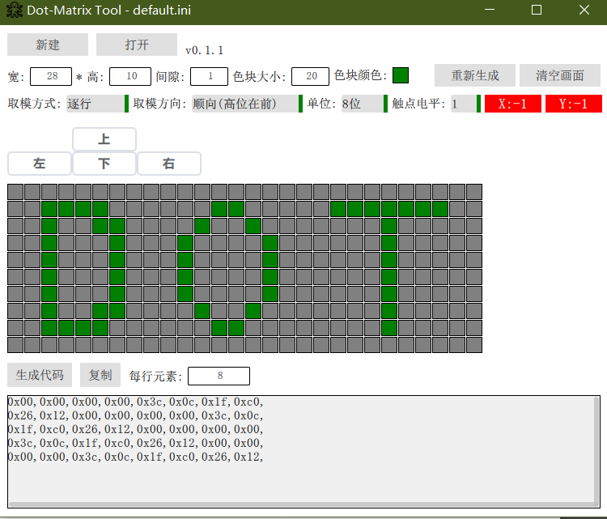

# dot-matrix-tool

## 一个手动点阵工具
该工具可以自定义任意长宽的点阵屏,手动画出需要的图案后,可以导出到需要的代码

为了方便在嵌入式上自定义字体开发的小工具

## 直接使用

可以在release中直接下载编译好的文件

使用时每个自定义的图案会保存成ini文件,然后保存在程序目录下
输入需要的长宽, 点击生成后就可以开始绘图了

## 编译使用

本项目基于Qt5.12.12 - cmake开发
可以直接打开编译

## 有问题可以到issues

## TODO
1.导入字库文件,直接输入文字
2.导入图片
3.导入自定义的内容
4.模块化导入内容,并可移动
